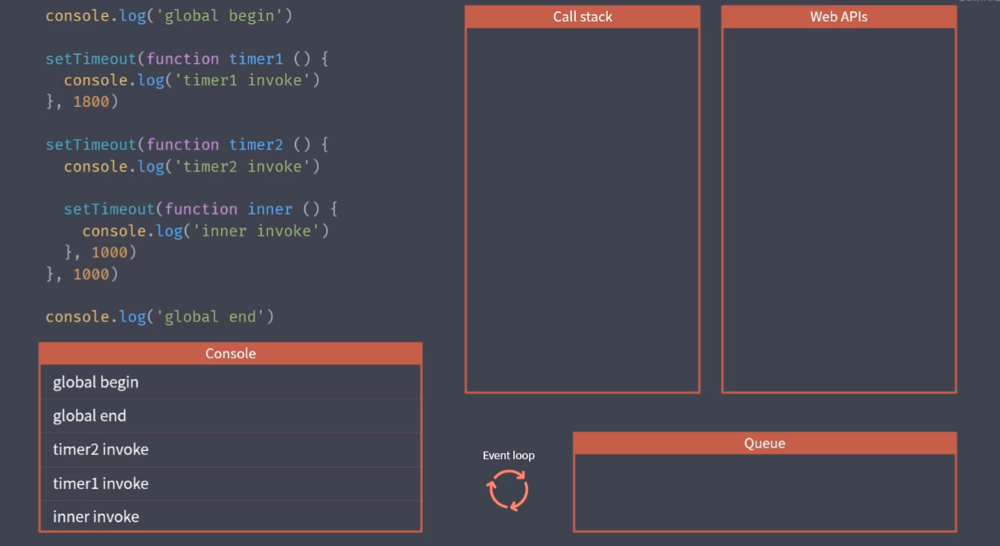
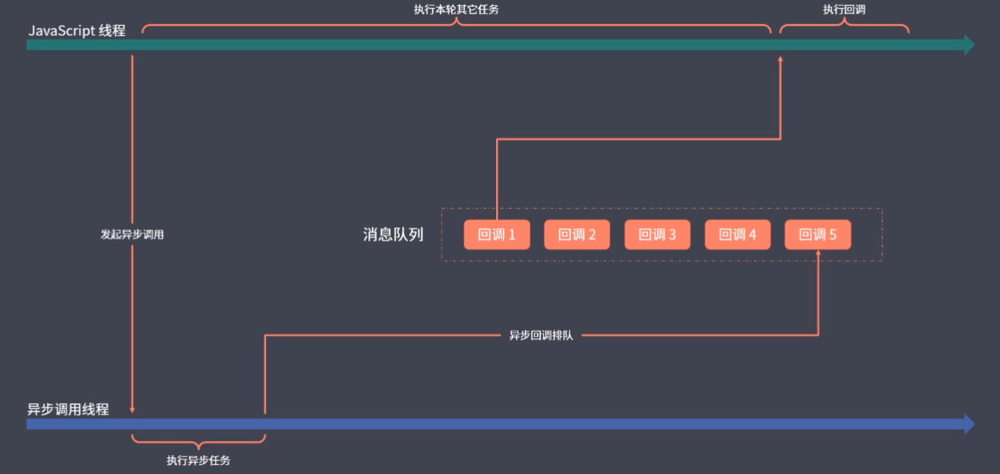

# JS异步编程
## 1.同步模式 Synchronous
如果某一行代码执行时间过长，会导致阻塞
## 2. 异步模式 Asynchronous
js是单线程的，浏览器不是单线程的


## 3. 回调函数 
- 所有异步编程方案的根基，容易产生回调地狱
## 4. Promise

### 4.1 基本用法
```javascript
const promise = new Promise((resolve, reject) => {
    resolve(10)
})
promise.then((value)=>{
    console.log('resolved', value)
}, (error)=>{
    console.lolg('rejected', error)
})
```

### 4.2 Promise方式的ajax
```javascript
function ajax(url) {
    return new Promise((resolve, reject)=>{
        let xhr = new XMLHttpRequest()
        xhr.open('GET', url)
        xhr.responseType = 'json'
        xhr.onload = ()=>{
            if(this.status === 200) {
                resolve(this.response)
            } else {
                reject(new Error(this.statusText))
            }
        }
        xhr.send()
    })
}

ajax('api/测试地址').then(res=>{
    console.log(res)
},error=>{
    console.log(error)
})
```

### 4.3 Promise链式调用

- Promise对象的then方法会返回一个全新的Promise对象

- 后面的then方法就是在为上一个then返回的Promise注册回调

- 前面then方法中回调函数的返回值会作为后面then方法回调的参数

- 如果回调中返回的是Promise，那后面then方法的回调会等待他的结束

### 4.4 Promise异常处理
推荐使用catch进行异常捕获
```javascript
ajax('/api/hhh.json')
    .then(value=>{
        console.log(value)
        return ajax('/error-url')
    }, erroe=>{
        console.log(error)
    })

ajax('/api/hhh.json')
    .then(value=>{
        console.log(value)
        return ajax('/error-url')
    })
    .catch(error=>{
        console.log(error)
    })
```

### 4.5 Promise静态方法

- Promise.resolve() 将一个值转化为一个状态为成功的Promise对象，若传入的是Promise对象，该对象会被原样返回
```javascript
Promise.resolve('wang')
    .then(value=>{
        console.log(value)
    })
```

- Promise.reject()

- Promise.all([promise1, promise2]) 并行执行，全成功为成功

- Promise.race()只会等待第一个结束的任务

### 4.6 Promise执行时序
Promise 微任务
setTomeout 宏任务
微任务 执行优先级高于 宏任务

### 4.7 Promise类核心逻辑

- 1. Promise 就是一个类，在执行这个类的时候，需要传递一个执行器进去，执行器会立即执行

- 2. Promise 中有三种状态，分别为 成功 fulfilled、失败 rejected、等待 pending
    pending -> fulfilled
    pending -> rejected

- 3. resolve 和 reject函数是用来更改状态的
    resolve: fulfilled
    reject: rejected

- 4. then方法内部做的事情就是判断状态，如果状态是成功，调用成功的回调函数，如果是失败，调用失败的回调函数，then方法是被定义在原型对象中的

## 5 Generator异步方案
```javascript
function ajax(url) {
    return new Promise((resolve, reject)=>{
        let xhr = new XMLHttpRequest()
        xhr.open('GET', url)
        xhr.responseType = 'json'
        xhr.onload = ()=>{
            if(this.status === 200) {
                resolve(this.response)
            } else {
                reject(new Error(this.statusText))
            }
        }
        xhr.send()
    })
}

function * main() {
    const users = yield ajax("/api/users.json")
    console.log(users)
}

const g = main()

const result = g.next()

// result.value.then(data => {
//     g.next(data)
// })

function handleResult(result) {
    if(result.done) return
    result.value.then(data => {
        handleResult(g.next(data))
    }, error => {
        g.throw(error)
    })
}

handleResult(g.next())

```